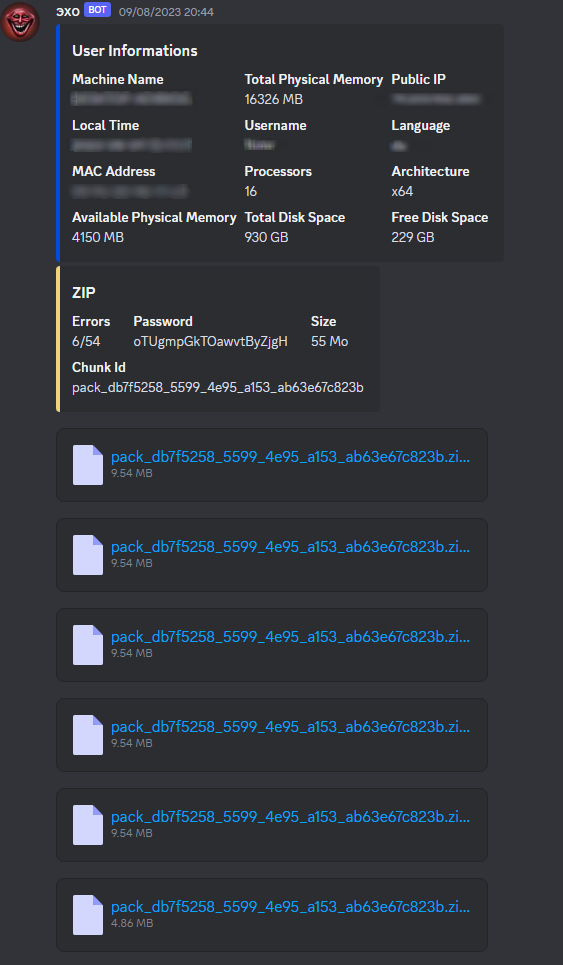

# ADR 💥

ADR is a trojan that retrieves all information on the computer and all data stored in applications using chormium. It recovers cookies, tokens, passwords and saved bank cards. This malware is undetectable by Windows Defender, Chrome, Virustotal (2/71).

> ❗ This project has a strictly educational objective. It aims to provide information, advice and resources in an educational context. I want to emphasize that I do not support or encourage any malicious or damaging use of this information. Any negative or abusive interpretation goes against the educational intent of this project. As the creator of this content, I accept no responsibility for any misuse that may arise from its use.

## bADR (exe)

bADR is the entry program that will load ADR (the DLL that contains the malware).
bADR downloads the DLL online, this DLL is encrypted in XOR so as not to be detected by the antivirus. The DLL is then decoded and then injected into the memory of the process to execute the "main" function.

* download the DLL encode in XOR
* decode the XOR
* loading the DLL into memory (without using LoadLIbraryA)
* execution of the "main" function of the ADR malware


bADR uses a few tricks to avoid being detected by anti-viruses, in particular:

* hiding suspicious functions using LoadLibrary and GetProcAddress (so imports are hidden and not visible in the executable)
* the masking of character strings, the url at which the payload is located, encrypt in XOR so as not to be readable in the executable directly
* optimization of compiler parameters and compression with UPX

### Anti Virus

**bADR.exe**

*   ❔     Virustotal 2/70 
    *   ❌     Elastic (moderate)
    *   ❌     SecureAge(MALICIOUS)
    * ✅     70...
*   ✅     Windows Defender
*   ✅     Chrome AntiVirus
*   ✅     Manalyzer

## ADR (dll)

ADR is compiled in DLL, encoded in XOR, then uploaded to a server to be loaded later by bADR. 
the main function is the entry point of the malware, this function aims to:

* scan Windows AppData folder for folder using Chromium file structure
* recover all cookies, tokens, passwords, local state, credit card, history and autocompletion
* find all the information on the machine used
    * MAC Address
    * Public IP
    * Processor
    * Architecture
    * Storage
    * Local Time
    * Language
    * Machine Name
* all this data is then compressed into a Zip file which will be sent to a discord webhook (obviously this data can be sent to any public server or webhook).

### Anti Virus

**ADR.bin (XOR)**

*   ✅     Virustotal 72/72
*   ✅     Windows Defender
*   ✅     Chrome AntiVirus
*   ✅     Manalyzer


### UPX compression

ADR and bADR files are compressed with UPX to reduce the size of the payload.

```
bADR.exe 19.5 ko => 12 ko
ADR.dll 663 ko => 302 ko
```

### Demo

Once the malware is launched, all the information is then sent to a url. In the demo, it's a discord webhook that displays the data we collect.
This data comes from a Virustotal virtual machine that checks and analyzes the behavior of the malware.
Here is the message we receive from the webhook after the program is launched on one of these virtual machines:


